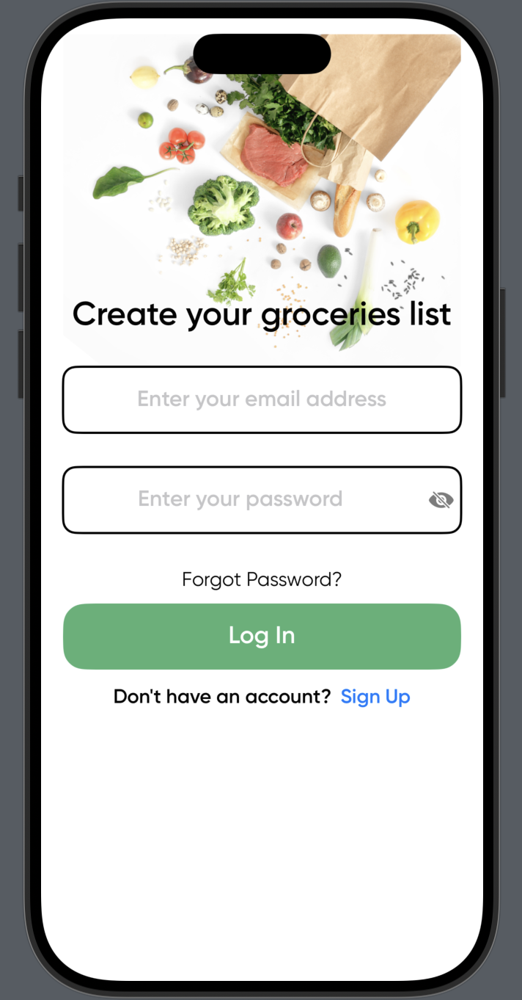

 # 🛒 GROCERIES-LIST

**Streamline your shopping, elevate your experience.**

A Swift-based iOS application that simplifies grocery shopping by allowing users to create, update, and manage grocery lists with ease.

---

## 📚 Table of Contents

- [Overview](#overview)
- [Features](#features)
- [Getting Started](#getting-started)
  - [Prerequisites](#prerequisites)
  - [Installation](#installation)
  - [Usage](#usage)
  - [Testing](#testing)
- [Backend Repository](#backend-repository)

---

## 📌 Overview

**Groceries List** is a powerful and intuitive application designed to help users manage their grocery items effortlessly. It offers an elegant interface, seamless navigation, and strong data handling to improve the overall shopping experience.

---

## ✨ Features

- 🧾 **User-Friendly Interface** — Simplifies the process of managing grocery lists.
- 💾 **Data Persistence** — Grocery lists are stored securely and persist across sessions.
- 🔄 **State Management** — Maintains consistent UI and smooth navigation.
- ⚙️ **Scalable Architecture** — Built with scalability and maintainability in mind.
- 🌟 **Custom Font Support** — Delivers a polished and visually consistent experience.

---

## 🚀 Getting Started

Follow these steps to get up and running with Groceries List:

### ✅ Prerequisites

Ensure you have the following tools installed:

- **Swift** programming language
- **Swift Package Manager** – [https://www.swift.org](https://www.swift.org)

---

### ⚙️ Installation

1. **Clone the repository:**

   ```bash
   git clone https://github.com/anuragshrestha/Groceries-List

2) **Navigate to the project directory:**

   ```bash
   cd Groceries-List

3) **Install the dependencies:**
   * Using swift_package_manager: https://www.swift.org
  
   
    ```bash
    swift build

### ▶️Usage

**Run the project with:**
  * Using swift_package_manager: https://www.swift.org
   ```bash
   swift run

```
### 🧪Testing


* Using swift_package_manager: https://www.swift.org

```bash
swift test
  ```

## 🔗 Backend Repository

👉 [Groceries List Backend Repository](https://github.com/anuragshrestha/Groceries_List_backend)


## 📸 Screenshots

Here are a few glimpses of the Groceries List app in action:

### 🏠 SignIn Screen


